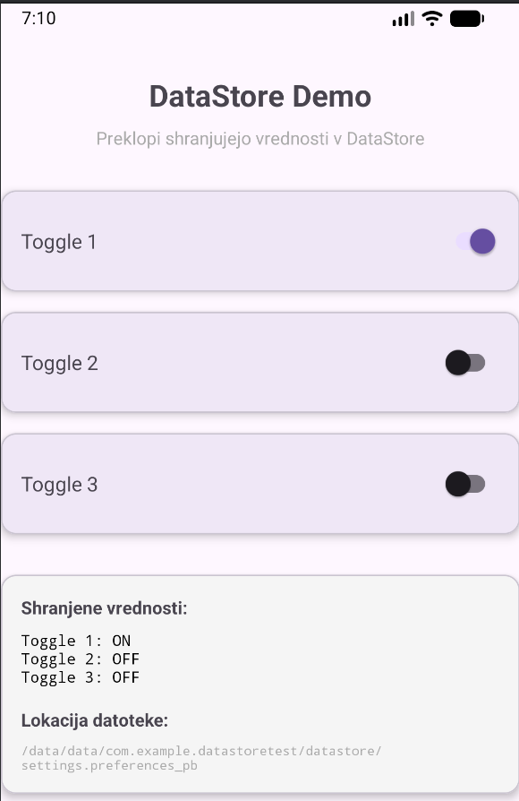

# Predstavitev knjižnice: AndroidX DataStore

Repozitorij: https://github.com/androidx/androidx/tree/androidx-main/datastore

---

## 1. Kaj je DataStore?

**DataStore** je sodobna knjižnica iz paketa **AndroidX**, namenjena shranjevanju ključ–vrednost podatkov ali tipiziranih objektov v Android aplikacijah.  
Razvita je kot **nadomestilo za SharedPreferences**, z boljšim upravljanjem podatkov, asinhronim delovanjem in podporo za Kotlin Coroutines ter Flow.

DataStore je **platformno odvisna tehnologija**, saj je tesno povezana z Android operacijskim sistemom in AndroidX ekosistemom.

---

## 2. Utemeljitev izbire

DataStore je primerna izbira, kadar:
- razvijamo **Android aplikacije**,
- potrebujemo **varno, konsistentno in asinhrono shranjevanje podatkov**,
- želimo sodoben API, ki se dobro integrira s **Kotlinom** in **Jetpack arhitekturo**.

Izbrana je bila zato, ker predstavlja **uradno priporočeno rešitev Googla** za lokalno shranjevanje manjših količin podatkov v Android aplikacijah.

---

## 3. Prednosti

- **Uradna AndroidX knjižnica** (razvija in vzdržuje Google)
- **Asinhrono delovanje** (brez blokiranja glavne niti)
- Podpora za **Kotlin Coroutines in Flow**
- **Tipna varnost** (z uporabo Proto DataStore)
- Boljša **zanesljivost** v primerjavi s SharedPreferences
- Dobro se povezuje z ostalimi Jetpack komponentami

---

## 4. Slabosti

- **Platformno omejena** (uporabna samo za Android)
- **Višja kompleksnost** kot SharedPreferences
- Zahteva osnovno poznavanje **Coroutines** in **Flow**
- Manj primerna za zelo velike količine podatkov (ni zamenjava za bazo)

---

## 5. Licenca

- **Apache License 2.0 (Apache-2.0)**  
  Enaka licenca kot ostale AndroidX knjižnice.

---

## 6. Število uporabnikov (ocena)

Natančnega števila uporabnikov ni mogoče določiti, vendar:
- DataStore je del **AndroidX**, ki se uporablja v **milijonih Android aplikacij**
- Gre za **standardno priporočeno rešitev** v uradni Android dokumentaciji
- Uporablja jo velika večina sodobnih Android projektov, ki sledijo Jetpack smernicam

**Ocena**: zelo široka uporaba v Android ekosistemu (industrijski standard).

---

## 7. Časovna in prostorska zahtevnost (ocena)

### Časovna zahtevnost
- Branje podatkov: **O(1)** za enostavne ključe
- Pisanje podatkov: **O(1)** glede na velikost zapisa
- Skupni čas je odvisen od **I/O operacij** in velikosti podatkov

### Prostorska zahtevnost
- **O(n)**, kjer je *n* velikost shranjenih podatkov
- Optimizirano za **majhne do srednje velike količine podatkov**

---

## 8. Vzdrževanje tehnologije

- **Razvijalec**: Google (AndroidX ekipa)
- **Število razvijalcev**: večja interna ekipa (desetine razvijalcev)
- **Aktivno vzdrževana**: da
- **Zadnje spremembe**: redne posodobitve v okviru AndroidX repozitorija
- DataStore se posodablja skupaj z novimi verzijami Android Jetpack knjižnic

Tehnologija je **stabilna, aktivno razvita in dolgoročno podprta**.

---

## 9. Kako vključimo DataStore v projekt


### Dodajanje odvisnosti (Gradle)

```gradle
dependencies {
    implementation "androidx.datastore:datastore-preferences:1.0.0"
}
```

### Demo


